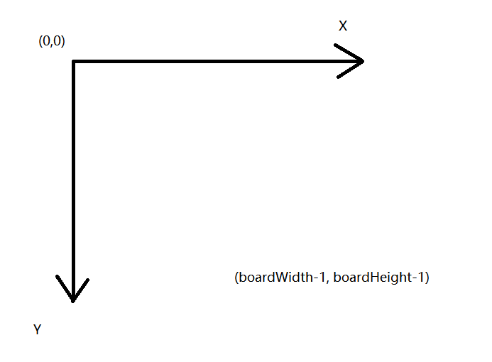
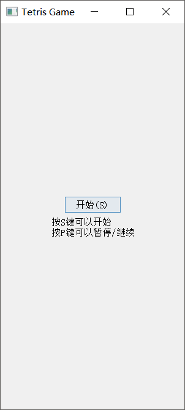
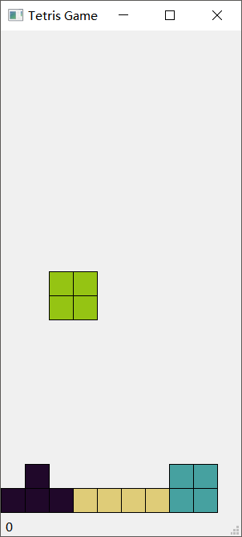
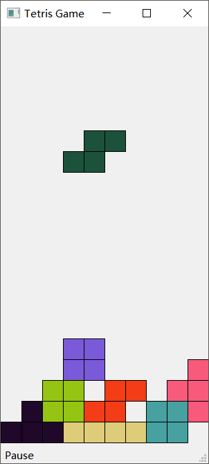

俄罗斯方块
==========

工具
----------
- PyQt5
- Sublime Text 3
- [PyQt5学习与交流-鱼C论坛](http://bbs.fishc.com/thread-59816-1-1.html)
- [PyQt5 tutorial-zetcode](http://zetcode.com/gui/pyqt5/)

类的设计
-------
- StartGame.main()
游戏的入口
- class Shape(Object)
游戏的逻辑设计
	- 俄罗斯方块的形状设计
	- 旋转俄罗斯方块
	- 随机得到一个俄罗斯方块及其颜色
- class BoardUI(QWidget)
俄罗斯方块的主界面的设计
	- 画出所有俄罗斯方块
	- 处理所有键盘的响应
	- 控制俄罗斯方块的下落
	- 判断俄罗斯方块是否能够继续下落和旋转
	- 消除已经满一行的俄罗斯方块
	- 保存分数
- class Tetris(QMainwindow)
游戏主框体
	- 添加开始按钮
	- 添加游戏界面BoardUI

游戏思路
---------
1. 因为绘图工具都是以像素为单位绘制的，极不方便，所以自定一个相对坐标，最左上角为(0, 0)，右下角为(width-1, height-1)
  

  
所以board就是由width*height的格子组成，每个格子边长为30pix
2. 每个俄罗斯方块都有个中心点(0, 0)，其他方块是以该中心点的相对坐标
如. T俄罗斯方块 四个点为 (-1, 0), (0, 0), ( 1,  0), (0, -1) ，这样子方块旋转就是以(0,0) 点为中心点
3. 将每个俄罗斯方块放到board中的时候，给定一个(x, y) 位置，那么这个俄罗斯方块在board中的位置就是唯一确定的了，俄罗斯方块的中心点为(0,0) 变为(x,y)，那么其他几块就是直接加上(x, y)  如：(-1, 0) + $\vec{p}$ (x,y)
4. 在BoardUI中，我用SQ表明是正字下落的俄罗斯方块，squares是已经下落的俄罗立方块，保存着每个矩形点和他的颜色
5. 判断能否消除一行：遍历每一个在squares中的点，如果这个点所在行已经满了，该点直接删除，如果这个点下面的行已经满了，直接将该点下移一行。

游戏说明
--------
- StartGame中直接运行
- 按开始或者S键运行游戏
- 游戏开始后，按左右方向键控制位置移动，按上下键旋转俄罗斯方块。按p键暂停游戏，按s键重新开始游戏
- 最下面statusBar显示当前分数和运行状态

游戏界面
---------
- 游戏初始界面
  

- 游戏运行界面
  

- 游戏暂停界面
  

遇到的问题
------------
按了开始键运行游戏的时候，怎么也无法使Focus弄到当前BoardUI上，导致无法响应keyEvent。我只能通过重写Tetris的keyPressEvent直接调用BoardUI的keyPressEvent，绕过这一问题 